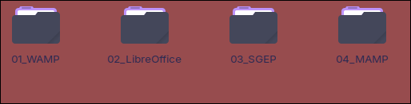

# Guía de instalación y entrega — SGEP v1.0

**Sistema de Gestión de Etapa Productiva**  
SENA — CDITI

Documento para el **directivo o administrador** que recibe el sistema en **memoria USB** o ZIP y debe instalarlo en un PC con **Windows (WAMP)** o **macOS (MAMP)**.

---

## Índice

1. [Alcance y limitaciones de la entrega](#1-alcance-y-limitaciones-de-la-entrega)
2. [Contenido de la memoria USB](#2-contenido-de-la-memoria-usb)
3. [Requisitos del equipo](#3-requisitos-del-equipo)
4. [Instalación desde la memoria USB (visión general)](#4-instalación-desde-la-memoria-usb-visión-general)
5. [Instalación en Windows con WAMP](#5-instalación-en-windows-con-wamp)
6. [Instalación en macOS con MAMP](#6-instalación-en-macos-con-mamp)
7. [Uso diario y actualizaciones](#7-uso-diario-y-actualizaciones)
8. [Errores comunes y solución](#8-errores-comunes-y-solución)
9. [Checklist post-instalación](#9-checklist-post-instalación)
10. [Documentación adicional](#10-documentación-adicional)

---

## 1. Alcance y limitaciones de la entrega

### Qué incluye SGEP v1.0

| Módulo | Descripción |
|--------|-------------|
| **Importación** | Carga masiva de aprendices desde Excel (formato definido en el SRS). |
| **Catálogo** | Programas de formación y aprendices. |
| **Reporte maestro** | Consulta, edición en drawer y exportación a Excel. |
| **Documentos F-023** | Generación GFPI-F-023 en Word (.docx); PDF opcional con LibreOffice. |
| **Historial de documentos** | Registro y descarga de F-023 generados. |

### Qué **no** incluye esta versión

- **Autenticación / login:** el sistema **no tiene usuarios ni contraseñas**. Está pensado para uso en **red interna** o en un **PC controlado** del centro de formación.
- **Servidor en la nube:** todo corre **en local** en el PC donde se instala. No requiere internet para operar.
- **LibreOffice:** no viene incluido. Solo hace falta si se desea exportar F-023 a **PDF** (Word funciona sin LibreOffice).
- **WAMP / MAMP:** el directivo debe instalarlos **una sola vez** en el PC; el paquete SGEP trae el código de la aplicación, no el servidor web.

### Supuestos de operación

- Un solo usuario o equipo de trabajo por instalación.
- Respaldo de la base de datos MySQL (`sgep`) responsabilidad del centro (phpMyAdmin → Exportar).
- Los datos **no se sincronizan** entre PCs; cada instalación es independiente.

---

## 2. Contenido de la memoria USB

Al conectar la USB debería ver algo similar a esto:

```
USB (memoria)
├── LEEME.txt                 ← Inicio rápido (texto plano)
├── SGEP_v1.0.zip             ← Paquete completo del sistema
└── (opcional) INSTRUCCIONES.pdf
```

**Imagen sugerida** — agregue la captura en `docs/imagenes/01-contenido-usb.png`:



> **Nota:** Si la imagen aún no existe, verá un enlace roto en algunos visores Markdown. Coloque el PNG en `docs/imagenes/` con el nombre indicado. Convención completa: [imagenes/README.md](imagenes/README.md).

### Dentro del ZIP (`SGEP_v1.0.zip`)

Tras descomprimir:

```
sgep/
├── instalar.bat              ← Windows: primera instalación
├── actualizar.bat            ← Windows: actualizar versión
├── abrir_sgep.bat            ← Abrir navegador cada día
├── SGEP.url                  ← Acceso directo (copiar al escritorio)
├── LEEME.txt
├── docs/
│   ├── GUIA-INSTALACION-ENTREGA.md   ← Este documento
│   └── imagenes/                     ← Carpeta para capturas
├── scripts/macos/
│   ├── instalar.sh
│   ├── actualizar.sh
│   └── abrir_sgep.sh
├── public/                   ← Raíz web (Apache apunta aquí)
├── database/
│   └── run_migrations.php
├── .env.example
└── vendor/                   ← Dependencias PHP (ya incluidas)
```

**Importante:** copie **toda** la carpeta `sgep` al servidor local (`www` o `htdocs`). No extraiga solo archivos sueltos.

---

## 3. Requisitos del equipo

| Componente | Windows | macOS |
|------------|---------|-------|
| Sistema operativo | Windows 10/11 (64 bits) | macOS 12+ recomendado |
| Servidor local | [WAMP](https://www.wampserver.com) | [MAMP](https://www.mamp.info) |
| PHP | 8.2+ (incluido en WAMP/MAMP) | 8.2+ (incluido en MAMP) |
| MySQL | 8.0+ (incluido) | 8.0+ (incluido) |
| Navegador | Chrome, Edge o Firefox | Safari, Chrome o Firefox |
| Espacio en disco | ~500 MB (proyecto + BD) | ~500 MB |
| Internet | Solo para **descargar** WAMP/MAMP la primera vez | Igual |

El directivo **no** necesita instalar Composer, Node.js ni Git.

---

## 4. Instalación desde la memoria USB (visión general)

Pasos comunes en **ambos** sistemas operativos:

1. **Insertar la USB** y copiar `SGEP_v1.0.zip` al escritorio (o descomprimir directamente desde la USB).
2. **Descomprimir** el ZIP (clic derecho → *Extraer todo* en Windows; doble clic en Mac).
3. **Instalar WAMP o MAMP** si aún no está instalado (solo la primera vez).
4. **Verificar** que Apache y MySQL están **activos** (icono verde).
5. **Copiar** la carpeta `sgep` a la carpeta web del servidor:
   - Windows: `C:\wamp64\www\sgep\`
   - Mac: `/Applications/MAMP/htdocs/sgep/`
6. **Ejecutar el instalador** del proyecto (`instalar.bat` o `bash instalar.sh`).
7. **Abrir el navegador** en la URL indicada al finalizar.

---

## 5. Instalación en Windows con WAMP

### 5.1 Instalar WAMP (solo la primera vez)

1. Descargue WAMP desde [wampserver.com](https://www.wampserver.com).
2. Ejecute el instalador → Siguiente → Finalizar.
3. Inicie WAMP desde el menú Inicio.

**Imagen:** `docs/imagenes/02-wamp-instalador.png`


4. En la **bandeja del sistema** (esquina inferior derecha), el icono de WAMP debe quedar **verde**.

**Imagen:** `docs/imagenes/04-wamp-icono-verde.png`


> Si el icono está **naranja** o **rojo**, Apache o MySQL no están activos. Vea [§8.1 WAMP no pone todos los servicios en verde](#81-wamp-no-activa-todos-los-servicios-icono-naranja-o-rojo).

### 5.2 Copiar el proyecto desde la USB

1. Descomprima `SGEP_v1.0.zip`.
2. Copie la carpeta `sgep` completa a:

   ```
   C:\wamp64\www\sgep\
   ```

   La ruta final debe contener, por ejemplo: `C:\wamp64\www\sgep\instalar.bat`

**Imagen:** `docs/imagenes/06-copiar-carpeta-www.png`


### 5.3 Crear la base de datos (opcional)

El script `instalar.bat` **puede crear** la base de datos automáticamente. Si prefiere hacerlo manualmente:

1. Abra [http://localhost/phpmyadmin](http://localhost/phpmyadmin)
2. Pestaña **Bases de datos** → Nombre: `sgep` → Cotejamiento: `utf8mb4_unicode_ci` → **Crear**

**Imagen:** `docs/imagenes/07-phpmyadmin-crear-bd.png`


### 5.4 Ejecutar `instalar.bat`

1. Abra `C:\wamp64\www\sgep\` en el Explorador de archivos.
2. Doble clic en **`instalar.bat`**.
3. Si pide contraseña MySQL: en WAMP por defecto **`root` sin contraseña** → pulse **Enter**.
4. Espere el mensaje **"Instalacion finalizada"**.
5. Responda **S** para abrir el navegador, o use `abrir_sgep.bat` / `SGEP.url`.

**Imagen:** `docs/imagenes/08-instalar-bat.png`


### 5.5 Abrir el SGEP

URL correcta (Apache ya apunta a la carpeta `public/`):

```
http://localhost/sgep/
```

**No** use `http://localhost/sgep/public` en la barra del navegador.

**Imagen:** `docs/imagenes/09-sgep-dashboard.png`


### 5.6 Acceso directo diario (recomendado)

- Copie **`SGEP.url`** al escritorio, **o**
- Use **`abrir_sgep.bat`** cada vez que vaya a trabajar.

Requisito previo: **WAMP en verde** antes de abrir el navegador.

---

## 6. Instalación en macOS con MAMP

### 6.1 Instalar MAMP (solo la primera vez)

1. Descargue **MAMP** (versión gratuita) desde [mamp.info](https://www.mamp.info).
2. Arrastre MAMP a **Aplicaciones** e ábralo.
3. Pulse **Start** — Apache y MySQL deben mostrarse en **verde**.

**Imagen:** `docs/imagenes/10-mamp-start.png`


### 6.2 Activar reescritura de URLs (obligatorio en Mac)

Sin este paso, la portada puede abrir pero rutas como `/dashboard` darán **404**.

1. En MAMP, pulse **Stop**.
2. Abra con un editor de texto:

   ```
   /Applications/MAMP/conf/apache/httpd.conf
   ```

3. Busque `rewrite_module` y deje la línea **sin** `#`:

   ```apache
   LoadModule rewrite_module modules/mod_rewrite.so
   ```

4. Busque `<Directory "/Applications/MAMP/htdocs">` y confirme:

   ```apache
   AllowOverride All
   ```

5. Guarde, reinicie MAMP → **Start**.

**Imagen:** `docs/imagenes/11-mamp-httpd-rewrite.png`


### 6.3 Copiar el proyecto desde la USB

1. Descomprima `SGEP_v1.0.zip` (puede hacerlo en el Escritorio).
2. Copie la carpeta `sgep` a:

   ```
   /Applications/MAMP/htdocs/sgep/
   ```

   En Finder: **Ir → Ir a la carpeta…** (`Cmd + Shift + G`) y pegue la ruta.

> **Tip:** Si copió scripts `.sh` desde una USB formateada en Windows, puede aparecer el error `bash\r`. Vea [§8.6](#86-mac-error-env-bashr-al-ejecutar-scripts-desde-usb).

### 6.4 Ejecutar el instalador

Abra **Terminal** (`Cmd + Espacio` → escriba *Terminal*):

```bash
cd /Applications/MAMP/htdocs/sgep/scripts/macos
bash instalar.sh
```

- Contraseña MySQL: en MAMP por defecto es **`root`** → pulse Enter.
- El script ajusta `.env` automáticamente (puerto MySQL **8889**, URL **8888**).

**Imagen:** `docs/imagenes/12-mac-terminal-instalar.png`


### 6.5 Abrir el SGEP

```
http://localhost:8888/sgep/
```

Compruebe también:

- `http://localhost:8888/sgep/dashboard`
- `http://localhost:8888/sgep/aprendices`

Si solo la primera URL funciona, repita el paso [6.2](#62-activar-reescritura-de-urls-obligatorio-en-mac).

### 6.6 Uso diario en Mac

1. Abrir MAMP → **Start** (verde).
2. Terminal:

   ```bash
   cd /Applications/MAMP/htdocs/sgep/scripts/macos
   bash abrir_sgep.sh
   ```

   O cree un marcador en el navegador con la URL anterior.

### 6.7 Archivo `.env` oculto en Finder

Los archivos que empiezan con `.` no se ven por defecto. En Finder: **Cmd + Shift + .** para mostrarlos.

Plantilla alternativa visible: `scripts/macos/env.ejemplo.mamp` → copiar a `.env` si hace falta recrearlo.

---

## 7. Uso diario y actualizaciones

### Uso diario

| Paso | Windows | macOS |
|------|---------|-------|
| 1 | WAMP → icono **verde** | MAMP → **Start** (verde) |
| 2 | Doble clic `SGEP.url` o `abrir_sgep.bat` | `bash abrir_sgep.sh` |
| 3 | Trabajar en el navegador | Igual |

**No** vuelva a ejecutar `instalar.bat` / `instalar.sh` cada día; solo en la **primera** instalación o si reinstala desde cero.

### Actualizar a una nueva versión (desde USB)

1. Copie el nuevo ZIP y descomprima.
2. **Reemplace** archivos en la carpeta del proyecto **excepto** `.env` (conserva la configuración y datos).
3. Ejecute:
   - Windows: **`actualizar.bat`**
   - Mac: **`bash actualizar.sh`**

Los datos en MySQL se conservan; el script aplica migraciones nuevas.

---

## 8. Errores comunes y solución

### 8.1 WAMP no activa todos los servicios (icono naranja o rojo)

**Síntoma:** el icono de WAMP en la bandeja **no está verde** (naranja = parcial, rojo = detenido).

**Imagen:** `docs/imagenes/03-wamp-icono-naranja-rojo.png`


**Causas frecuentes:**

| Causa | Qué hacer |
|-------|-----------|
| Apache no arrancó | Clic en icono WAMP → **Apache** → **Service administration** → **Start/Resume Service** |
| MySQL no arrancó | Igual con **MySQL** → Start/Resume |
| Puerto 80 ocupado (Skype, IIS, otro Apache) | WAMP → **Tools** → **Check port 80**; cierre la app que lo usa o cambie el puerto de Apache en WAMP |
| Falta Visual C++ Redistributable | Instale los VC++ que indica el instalador de WAMP al finalizar |
| Servicio bloqueado tras apagado incorrecto | Reinicie el PC; luego inicie WAMP como administrador (clic derecho → Ejecutar como administrador) |

**Imagen:** `docs/imagenes/05-wamp-menu-servicios.png`


**Verificación:** icono **verde** → abra `http://localhost/` (debe cargar la página de WAMP).

---

### 8.2 `instalar.bat` dice que no encuentra PHP o falla la base de datos

**Síntoma:** *"No se encontro PHP"* o *"No se pudo crear la base de datos"*.

**Solución:**

1. Confirme WAMP **verde**.
2. Ejecute `instalar.bat` **desde** `C:\wamp64\www\sgep\` (no desde la USB sin copiar).
3. Contraseña MySQL: Enter vacío (WAMP por defecto).
4. Si persiste, abra phpMyAdmin y cree manualmente la BD `sgep` ([§5.3](#53-crear-la-base-de-datos-opcional)).

---

### 8.3 Página en blanco, 403 Forbidden o 500 Server Error

**403 Forbidden**

- Clic derecho icono WAMP → Apache → `httpd.conf`
- Busque `AllowOverride None` en el bloque del directorio `www` y cámbielo a **`AllowOverride All`**
- Reinicie WAMP

**500 Server Error**

- Revise que exista `.env` (copiado desde `.env.example` por el instalador).
- Revise logs: WAMP → PHP → PHP error log; o MAMP → Logs.

---

### 8.4 "No se puede conectar a MySQL" / error de base de datos

| Entorno | Verificar en `.env` |
|---------|---------------------|
| WAMP | `DB_HOST=127.0.0.1`, `DB_PORT=3306`, `DB_PASSWORD=` (vacío) |
| MAMP | `DB_PORT=8889`, `DB_PASSWORD=root` |

MySQL debe estar en marcha (WAMP/MAMP verde). Pruebe phpMyAdmin o, en Mac:

```bash
/Applications/MAMP/Library/bin/mysql -u root -proot -P 8889 -e "SHOW DATABASES;"
```

---

### 8.5 Las rutas `/dashboard`, `/aprendices` dan 404 (Mac)

Apache no está reescribiendo URLs. Repita [§6.2](#62-activar-reescritura-de-urls-obligatorio-en-mac), reinicie MAMP y recargue con **Cmd + Shift + R**.

---

### 8.6 Mac: error `env: bash\r` al ejecutar scripts desde USB

**Síntoma:** al ejecutar `bash instalar.sh` aparece `No such file or directory` relacionado con `\r`.

**Causa:** el archivo `.sh` tiene finales de línea Windows (CRLF) por copiar desde USB formateada en FAT/exFAT.

**Solución:**

```bash
cd /Applications/MAMP/htdocs/sgep/scripts/macos
sed -i '' 's/\r$//' instalar.sh actualizar.sh abrir_sgep.sh
bash instalar.sh
```

**Imagen (opcional):** `docs/imagenes/13-error-bash-cr.png`


---

### 8.7 Los estilos se ven rotos (sin colores / diseño)

Falta `public/css/app.css` en el paquete. Contacte al equipo de desarrollo para un ZIP reconstruido con CSS compilado.

---

### 8.8 Exportación PDF del F-023 no funciona

Word (.docx) **sí** funciona sin LibreOffice. Para PDF:

1. Instale [LibreOffice](https://www.libreoffice.org).
2. En la carpeta del proyecto:

   ```bash
   php scripts/check_pdf_converter.php
   ```

   Debe responder: `OK: motor PDF disponible.`

3. Si no lo detecta, en `.env`:

   ```env
   F023_LIBREOFFICE_PATH=C:\Program Files\LibreOffice\program\soffice.exe
   ```

   (Mac: `/Applications/LibreOffice.app/Contents/MacOS/soffice`)

4. Reinicie WAMP/MAMP tras editar `.env`.

Detalle: [06-despliegue.md § LibreOffice](06-despliegue.md#libreoffice-para-exportar-pdf-opcional).

---

### 8.9 Puerto distinto en MAMP (no 8888)

Si cambió el puerto Apache en MAMP, actualice `.env`:

```env
APP_URL=http://localhost:PUERTO/sgep
```

Reinicie Apache y use esa URL en el navegador.

---

## 9. Checklist post-instalación

Marque cada ítem tras la primera instalación:

- [ ] WAMP/MAMP con servicios **verdes**
- [ ] URL principal carga: `http://localhost/sgep/` (Win) o `:8888/sgep/` (Mac)
- [ ] Rutas internas cargan (`/dashboard`, `/aprendices`)
- [ ] Importación de prueba (Excel de ejemplo, si se proporcionó)
- [ ] Reporte maestro visible
- [ ] Generación F-023 en Word
- [ ] (Opcional) PDF con LibreOffice verificado
- [ ] Acceso directo en escritorio (`SGEP.url` o marcador)
- [ ] `.env` con `APP_DEBUG=false` (producción)

---

## 10. Documentación adicional

| Documento | Contenido |
|-----------|-----------|
| [LEEME.txt](../LEEME.txt) | Resumen de una página en la raíz del proyecto |
| [06-despliegue.md](06-despliegue.md) | Empaquetado, LibreOffice, referencia técnica |
| [01-INSTALACION.md](01-INSTALACION.md) | Instalación para desarrolladores |
| [manual-usuario.md](manual-usuario.md) | Uso del sistema |
| [imagenes/README.md](imagenes/README.md) | Nombres de capturas para esta guía |
| [scripts/macos/INSTRUCCIONES-MAC.md](../scripts/macos/INSTRUCCIONES-MAC.md) | Guía rápida Mac |

---

### Agregar capturas de pantalla (equipo de documentación)

1. Tome las capturas según la tabla en [imagenes/README.md](imagenes/README.md).
2. Guárdelas en **`docs/imagenes/`** con el nombre exacto (ej. `04-wamp-icono-verde.png`).
3. Vuelva a incluir la carpeta `docs/` en el ZIP de entrega.

Formato recomendado: **PNG**, ancho máximo **1200 px**.

---

*SGEP v1.0 — SENA CDITI*
